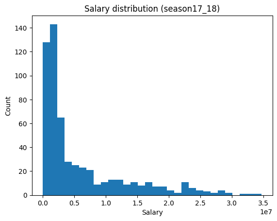
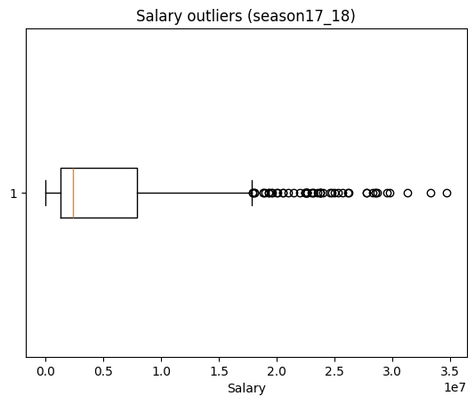
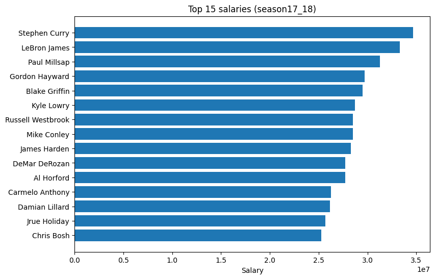
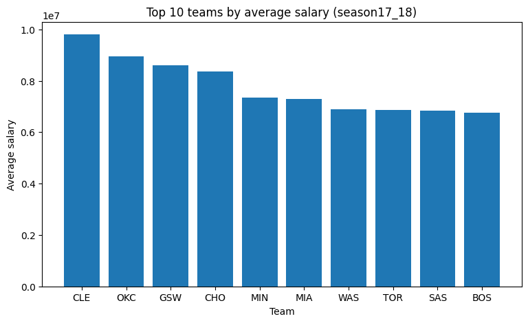

# NBA Salary EDA & Data Validation

Exploratory data analysis of NBA player salaries for the 2017–18 season, paired with automated data-quality checks using **Great Expectations** and an auto-generated PDF summary report.

## Overview

| | |
|---|---|
| **Dataset** | [`Yayun/nba-dataset-2`](https://huggingface.co/datasets/Yayun/nba-dataset-2) (Hugging Face): 573 rows × 4 columns (player, team, salary) |
| **Goal** | Understand the salary distribution, spot outliers, compare teams, and validate data quality |
| **Tools** | pandas, matplotlib, Great Expectations 1.x, fpdf2 |

## What the notebook does

1. **Load & clean**: pulls the dataset from the Hugging Face Hub, renames columns, and safely converts salary strings to numbers.
2. **Data-quality profile**: missing values, duplicate rows, duplicate player names.
3. **Exploratory plots**: salary histogram, outlier boxplot, top-15 earners, and the 10 highest-paying teams by average salary.
4. **Data validation with Great Expectations**: 9 expectations covering column existence, nulls, team-code format (`^[A-Z]{3}$`), salary range, and player uniqueness.
5. **PDF report**: summarizes findings and validation results into a one-page PDF with `fpdf2`.

## Results

- No missing cells and no fully duplicated rows.
- **8 of 9** expectations pass. The one failure, *player names are not unique* (69 duplicate entries), is expected: players traded mid-season appear once per team.
- Salaries are heavily right-skewed: a small group of max-contract players sits far above the median.

<p align="center">
  
  
</p>
<p align="center">
  
  
</p>

## Run it

```bash
pip install -r requirements.txt
jupyter notebook nba_salary_eda.ipynb
```

The dataset downloads automatically from the Hugging Face Hub on first run.
